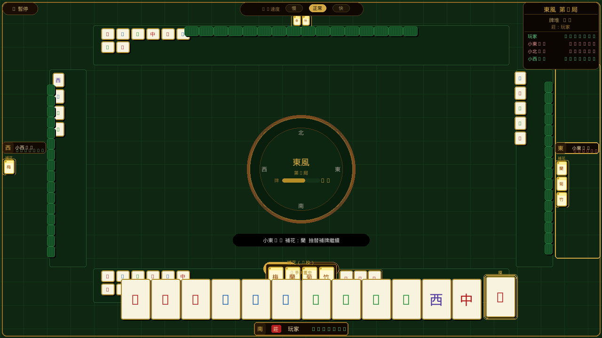

# 🀇 台灣麻將 — 單機版

> 純前端台灣 16 張麻將，無需安裝、無需伺服器，直接在瀏覽器玩。

**🎮 線上試玩：[https://lancelotwang114.github.io/mahjong/mahjong-solo.html](https://lancelotwang114.github.io/mahjong/mahjong-solo.html)**

---

## 畫面截圖



---

## 功能特色

- 🀄 **完整台灣麻將規則** — 16 張、花牌自動補牌、碰／吃／槓／胡
- 🤖 **三位 AI 對手** — 可調整速度（慢／正常／快）
- 🔊 **語音報牌** — 中文語音播報（Web Speech API）
- 💰 **完整計分系統** — 底台、花台、對對胡、清一色等台數計算
- ⏱️ **出牌計時器** — 可設定 8～20 秒限制
- 🎯 **聽牌偵測** — 自動顯示等待牌與剩餘張數
- 📱 **自動縮放** — 適應任意視窗大小

---

## 快速開始

### 直接開啟（本地）

```bash
git clone https://github.com/lancelotwang114/mahjong.git
cd mahjong
# 用任意瀏覽器開啟：
open mahjong-solo.html
```

> 也可用本地伺服器避免資源載入限制：
> ```bash
> python3 -m http.server 8080
> # 瀏覽器開啟 http://localhost:8080/mahjong-solo.html
> ```

### GitHub Pages

前往 `https://lancelotwang114.github.io/mahjong/mahjong-solo.html` 直接遊玩。

---

## 遊戲說明

| 動作 | 操作 |
|------|------|
| 打牌 | 點擊手牌中的牌 |
| 碰／吃／槓 | 輪到時自動出現按鈕，點擊選擇 |
| 胡牌 | 摸牌自摸或別家出牌時，出現「胡！」按鈕 |
| 不要 | 點「不要」跳過碰吃機會 |

### 大廳設定

- **底台**：1～3 台底
- **每台金額**：$50～$500
- **起始籌碼**：$5,000～$50,000
- **出牌限時**：無限制 or 8～20 秒
- **語音**：自動／女聲／男聲／關閉

---

## 專案結構

```
mahjong/
├── mahjong-solo.html   # 主遊戲（單一檔案，HTML+CSS+JS）
├── tiles-sprite.css    # 牌圖 Sprite 樣式
├── images/             # 牌圖資源（萬/筒/條/字/花）
├── CHANGELOG.md        # 版本更新紀錄
├── CLAUDE.md           # AI 開發指引
└── README.md           # 本文件
```

---

## 技術細節

- **純前端**：單一 `.html` 檔，零外部框架依賴
- **版面**：1280×720 固定設計尺寸，JS `transform: scale()` 自動適配視窗
- **音效**：Web Audio API 合成音
- **語音**：Web Speech API（需瀏覽器支援）
- **AI**：貪婪策略 + 防守機率計算

---

## 瀏覽器支援

| 瀏覽器 | 支援 |
|--------|------|
| Chrome / Edge | ✅ 完整支援 |
| Firefox | ✅ 支援（語音效果依系統而異） |
| Safari | ⚠️ 語音需使用者互動後才可啟動 |

---

## License

MIT License — 自由使用、修改、分發。
