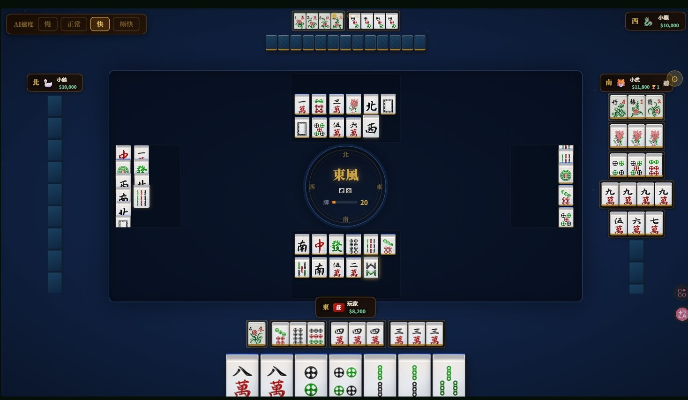
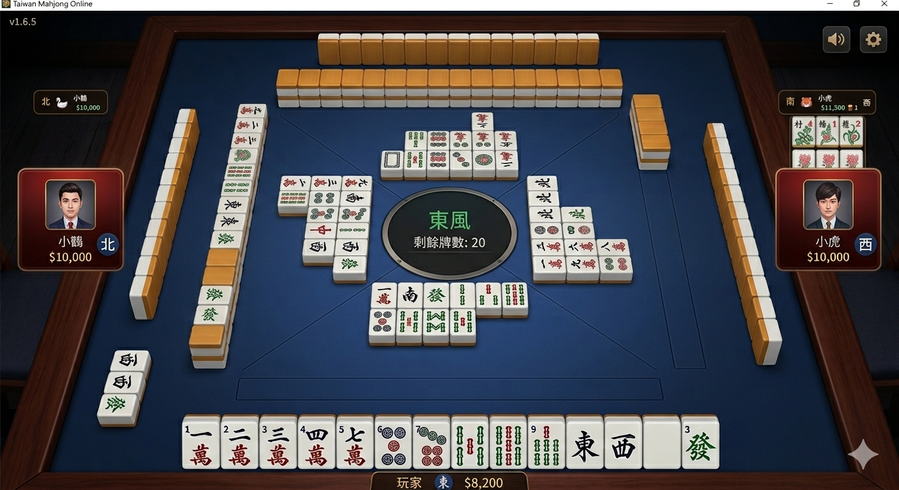

# 🀇 台灣麻將 Online

> 純前端台灣 16 張麻將，無需安裝、無需伺服器，直接在瀏覽器玩。支援單機 AI 對戰與 P2P 連線多人對戰。

| 版本 | 連結 | 說明 |
|------|------|------|
| 🀄 **標準版** | [**立即遊玩**](https://lancelotwang114.github.io/mahjong/) | 輕量高效，2D Sprite 渲染 |
| ✨ **3D 版** | [**index-3d.html**](https://lancelotwang114.github.io/mahjong/index-3d.html) | 極致擬真 CSS 3D 六面體麻將 |

---

## 畫面截圖

### 標準版


### ✨ 3D 版
> 採用 CSS `transform-style: preserve-3d` 六面體技術，每張牌皆為真實立體方塊：金色頂面、深木色側面、象牙正面，搭配四邊雙層牌牆與落地陰影，高度還原實體麻將手感。



---

## 功能特色

- 🀄 **完整台灣麻將規則** — 16 張、花牌自動補牌、碰／吃／槓／胡
- 🤖 **三位 AI 對手** — 單機模式，可調整速度（慢／正常／快）
- 🌐 **P2P 連線多人** — 建立房間分享代碼，4 人連線對戰
- 🔊 **語音報牌** — 中文語音播報（Web Speech API）
- 💰 **完整計分系統** — 底台、花台、對對胡、清一色等台數計算
- ⏱️ **出牌計時器** — 可設定 8～20 秒限制
- 🎯 **聽牌偵測** — 自動顯示等待牌與剩餘張數
- 📱 **自動縮放** — 適應任意視窗大小

### ✨ 3D 版額外特色

- 🧱 **CSS 3D 六面體麻將** — 每張牌為真實六面體（`preserve-3d`），具金色頂面、深木色側面
- 🏯 **四邊雙層牌牆** — 四側動態渲染雙層磚牆，隨摸牌逐步缺口
- 🎨 **實拍紋理貼圖** — `.tf-top / .tf-side` 直接採樣真實麻將截圖，非純 CSS 積木
- 💡 **落地 drop-shadow** — `filter: drop-shadow` 讓每張牌重力貼合藍色桌布
- 🌐 **多玩家視角** — 下家前傾 16°、左右家各 ±22° 旋轉，對家後仰，真實桌面透視

---

## 快速開始

### 線上遊玩

直接開啟：**[https://lancelotwang114.github.io/mahjong/](https://lancelotwang114.github.io/mahjong/)**

### 本地執行

```bash
git clone https://github.com/lancelotwang114/mahjong.git
cd mahjong
python3 -m http.server 8080
# 瀏覽器開啟 http://localhost:8080/
```

---

## 遊戲模式

### 🎮 單機對戰（AI）
進入大廳後點「單機對戰」，設定籌碼後選擇東風局（4 局）或南風局（8 局）開始。

### 🌐 連線對戰
點「連線對戰」→「建立房間」，複製房間代碼傳給朋友，4 人到齊後開始。
加入方點「加入房間」輸入代碼即可連線（使用 PeerJS P2P，無需伺服器）。

---

## 操作說明

| 動作 | 操作 |
|------|------|
| 打牌 | 點擊手牌中的牌 |
| 碰／吃／槓 | 輪到時自動出現按鈕，點擊選擇 |
| 胡牌 | 摸牌自摸或別家出牌時，出現「胡！」按鈕 |
| 跳過 | 點「不要」或按 Space 跳過碰吃機會 |
| 排序手牌 | 按 S 鍵 |

---

## 專案結構

```
mahjong/
├── index.html              # 主遊戲入口（標準版，HTML+CSS+JS 單一檔案）
├── index-3d.html           # ✨ 3D 版入口（CSS 六面體 + 雙層牌牆）
├── mahjong-solo.html       # 同 index.html（備用連結）
├── tiles-sprite.css        # 牌圖 Sprite 樣式
├── images/
│   ├── man/pin/sou/...     # 牌圖資源（萬/筒/條/字/花 PNG sprite）
│   ├── tile-back-face.png  # 3D 版：牌背金黃紋理（取自實拍截圖）
│   ├── tile-top-face.png   # 3D 版：頂面象牙紋理
│   ├── tile-side-face.png  # 3D 版：側面深木紋理
│   └── sample.png          # 3D 版參考截圖
├── CHANGELOG.md            # 版本更新紀錄
├── CLAUDE.md               # AI 開發指引
└── README.md               # 本文件
```

---

## 技術細節

- **純前端**：單一 `.html` 檔，零後端依賴
- **版面**：1280×720 固定設計尺寸，JS `transform: scale()` 自動適配視窗
- **連線**：PeerJS（WebRTC P2P），使用 peerjs.92k.de 中繼
- **音效**：Web Audio API 合成音 + BGM
- **語音**：Web Speech API（需瀏覽器支援）
- **AI**：貪婪策略 + 防守機率計算

---

## 瀏覽器支援

| 瀏覽器 | 支援 |
|--------|------|
| Chrome / Edge | ✅ 完整支援（建議） |
| Firefox | ✅ 支援（語音效果依系統而異） |
| Safari | ⚠️ 語音需使用者互動後才可啟動 |

---

## License

MIT License — 自由使用、修改、分發。
